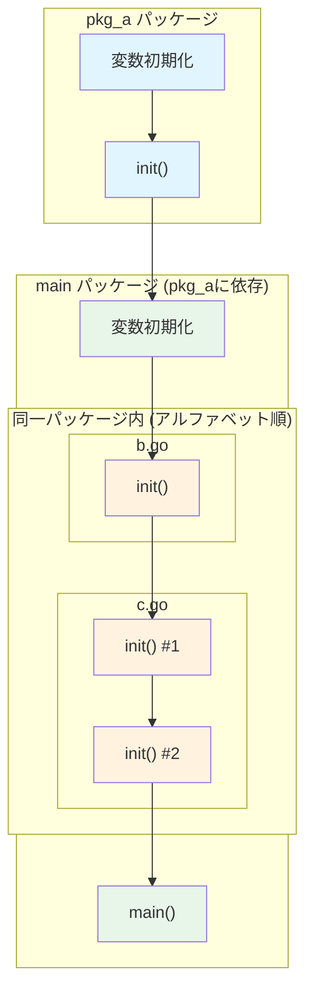

## 2.1 No.1：意図しない変数シャドウイング

### 間違い
- あるブロックで宣言された変数名は、内側のブロックでも再宣言できる。この規則は**変数シャドウイング**と呼ばれるが、これがよくある間違いになりがちである
  - 下記のコード例は、`client`変数を宣言しているが、`if`ブロック内で省略変数宣言演算子（`:=`）を使って、関数呼び出しの結果を外側の`client`ではなく、内側の`client`に代入している。結果、外側の`client`は常に`nil`のままになる（コードがコンパイルされても、値を受け取る変数が期待してたものでない状況に直面する）
```go
var client *http.Client
if tracing {
	client, err := createClientWithTracing()
	if err != nil {
		return err
	}
} else {
	client, err := createDefaultClient()
	if err != nil {
		return err
	}
}
```
### 解決策
- 解決のための2つの選択肢。どちらも完全に有効で選択は好みによる
#### 一時変数を使う方法

```go
	var client *http.Client
	if tracing {
		c, err := createClientWithTracing()
		if err != nil {
			return err
		}
		client = c
	} else {
		c, err := createDefaultClient()
		if err != nil {
			return err
		}
		client = c
	}
```
#### 内側のブロックで代入演算子(=)を使用し、関数の結果を直接clientに代入する方法
- 代入演算子はすでに宣言されている場合にのみ機能するので、`err`の変数を作成する必要がある。この場合、`if/else`文の外側でエラー処理を共通化して実装もできる
```go
	var client *http.Client
	var err error
	if tracing {
		client, err = createClientWithTracing()
	} else {
		client, err = createDefaultClient()
	}
	if err != nil {
		return err
	}
```
## 2.2 No.2：不必要にネストしたコード

### 間違い
- ネストが増えていくと読みやすさが失われていく
  - 下記は実装として正しい関数だが、ネストが非常に増えてしまっていて認知負荷が高まっている
```go
func join1(s1, s2 string, max int) (string, error) {
	if s1 == "" {
		return "", errors.New("s1 is empty")
	} else {
		if s2 == "" {
			return "", errors.New("s2 is empty")
		} else {
			concat, err := concatenate(s1, s2)
			if err != nil {
				return "", err
			} else {
				if len(concat) > max {
					return concat[:max], nil
				} else {
					return concat, nil
				}
			}
		}
	}
}

func concatenate(s1, s2 string) (string, error) {
	return "", nil
}
```
### 解決策
- **happy path**を左側に揃え、1列目を下まで目を通せば期待する実行の流れをすぐに確認できるようにするとコードが読みやすくなる
```go
func join2(s1, s2 string, max int) (string, error) {
	if s1 == "" {
		return "", errors.New("s1 is empty")
	}
	if s2 == "" {
		return "", errors.New("s2 is empty")
	}
	concat, err := concatenate(s1, s2)
	if err != nil {
		return "", err
	}
	if len(concat) > max {
		return concat[:max], nil
	}
	return concat, nil
}

func concatenate(s1, s2 string) (string, error) {
	return "", nil
}
```
  - `if`ブロックがリターンする時は、どのような場合でも`else`ブロックを省略すべき
```go
// Bad
if foo() {
  return true
 } else {
  // ...
 }
 
// Good
if foo() {
   return true
 }
 // ...
```
  - ロジックを非ハッピーパスで追って改善する
```go
// 非ハッピーパス
if s1 != "" {
  	// ...
} else {
  return "", errors.New("empty string")
}

// ハッピーパス
if s1 == "" {
  	return "", errors.New("empty string")
}
```
## 2.3 No.3：init関数の誤用
### 2.3.1init関数の概念

#### 特徴
- 引数を取らず、戻り値もない
- 1つのパッケージに複数定義可能（同一ファイル内でも可）
```go
func init() {
	fmt.Println("init 1")
}

func init() {
	fmt.Println("init 2")
}
```
- 明示的に呼び出すことはできない
```go
func init() {
	fmt.Println("init")
}

func main() {
	init() // コンパイルエラー
}
```

- パッケージがインポートされたときに自動実行される
#### 実行順序
- 依存パッケージの`init`関数が先に実行される
- パッケージ変数が初期化される
- `init`関数が実行される
- 同一パッケージ内では、ファイル名のアルファベット順、同一ファイル内では定義順に実行される

### 2.3.2 init関数を使うべき場合
#### init()関数使用が不適切な場合
```go
package main

import (
	"database/sql"
	"log"
	"os"
)

var db *sql.DB

func init() {
	dataSourceName := os.Getenv("MYSQL_DATA_SOURCE_NAME")
	d, err := sql.Open("mysql", dataSourceName)
	if err != nil {
		log.Panic(err)
	}
	err = d.Ping()
	if err != nil {
		log.Panic(err)
	}
	db = d
}
```
#### 上記のinit()関数は下記の問題を抱えている
- 呼び出し元でエラーハンドリング出来ない
  - `init()`関数はエラーを返さないので、エラーを通知するには`panic`を起こすしかなくなる
  - 接続失敗時のリトライやフォールバックをする余地がなくなってしまう
- テストしづらくなる
  - DB接続が必要のない単体テストを追加する場合、`init()`関数によって不必要なDB接続が必要になり、単体テスト実装を複雑化してしまう
- グローバル変数にコネクションプールを代入
  - どの関数でもグローバル変数を変更できる
  - グローバル関数に依存する関数を切り離せないので、単体テストが複雑になる可能性がある
#### 問題の解決
```go
package main

import (
	"database/sql"
)

func createClient(dataSourceName string) (*sql.DB, error) {
	db, err := sql.Open("mysql", dataSourceName)
	if err != nil {
		return nil, err
	}
	if err = db.Ping(); err != nil {
		return nil, err
	}
	return db, nil
}
```
**改善点**
- テストが書きやすくなる
- コネクションプールは、関数内にカプセル化される
- 呼び出し元でエラーハンドリングできる