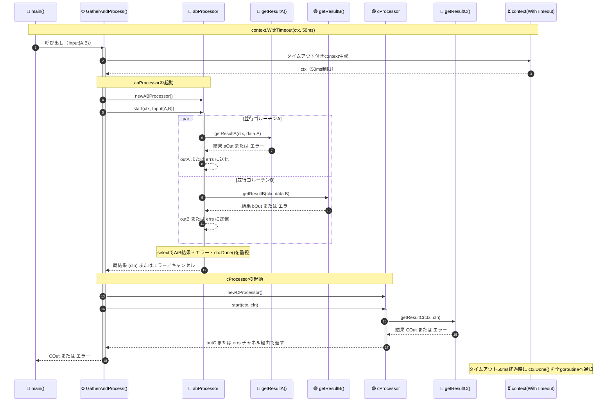

## 12.5.1 APIに並行性を含めない
- 並行性は実装に関する詳細情報なのでAPIとして表に出さないようにする。こうすることで表に出すAPIを変えることなく実装方法を変更できる
- 具体的には、APIとして公開する型、関数、メソッドにチャネルやミューテックスを含めないようにする
- 例外もあり、並行性関連の関数と一緒に使う場合はAPIの一部にチャネルを含めることもある
## 12.5.2 ゴルーチンとforループ
- Go 1.22よりも前のバージョンとそれ以降のバージョンでは`for`ループの動作が異なる。そのため、ゴルーチンで意図した挙動にならない場合があった
- Go 1.22よりも前のバージョンは各反復で同じインデックス変数と値変数が使い回される。そのため、下記のコードでは`v`に割り当てられた最後の値が10で、ゴルーチンが実行されるとその値が5回使用される
```go
package main

import "fmt"

func main() {
	a := []int{2, 4, 6, 8, 10}
	ch := make(chan int, len(a))
	for _, v := range a {
		go func() {
			ch <- v * 2
		}()
	}
	for i := 0; i < len(a); i++ {
		fmt.Println(<-ch) // 全て20で出力される
	}
}
```
  - Go 1.22以降では各反復で新しいインデックス変数と値変数が作成されるので、各値の倍数が出力される
  - どうしてもGo 1.22にアップグレードできない場合の解決方法は二つ
    - ループ内でシャドーイングして値のコピーを作成する
```go
	for _, v := range a {
		v := v // シャドーイング
		go func() {
			ch <- v * 2
		}()
	}
```
- ゴルーチンの引数に値を渡す
```go
	for _, v := range a {
		go func(val int) {
			ch <- v * 2
		}(v)
	}
```
- `for`ループ以外でも、値が変更される可能性のある変数をクロージャが使う場合は、引数を使って変数の現在の値のコピーして渡す方法が推奨される
## 12.5.3 ゴルーチンの終了チェック
- ゴルーチンとして実行される関数を起動する際は**確実に終了**するようにしなければならない
- 変数と違い、Goのランタイムはあるゴルーチンが「今後使われることのないもの」か検出できない
- ゴルーチンが終了しない場合、スタック状の変数に割り当てられた全てのメモリは割り当てられたままの状態になり、変数から参照されているヒープ上のメモリはGCできない。これを**ゴルーチンリーク（goroutine leak）**と呼ぶ
```go
package main

import (
	"fmt"
)

func countTo(max int) <-chan int {
	ch := make(chan int)

	go func() {
		for i := 0; i < max; i++ {
			ch <- i // 0からmax-1までの値を順にchに入れようとするが、
			// 6を入れたあとは、読み込んでもらえなくなる
		}
		close(ch)
	}()

	return ch
}

func main() {
	for i := range countTo(10) { //countToからチャネルが戻り、0...9が代入される
		fmt.Println(i)
		if i > 5 {
			break
		}
	}
	fmt.Println("main終了")
}
```
## 12.5.4 コンテキストを使ったゴルーチンの終了
- ゴルーチンリークを解消するよくある方法としてコンテキストを使う方法がある
```go
package main

import (
	"context"
	"fmt"
)

func countTo(ctx context.Context, max int) <-chan int {
	ch := make(chan int)

	go func() {
		defer close(ch) // ④チャネルをクローズする
		for i := 0; i < max; i++ {
			select {
			case <-ctx.Done(): // ③ctx.Done()が返すチャネルから読み込めた場合
				return // ゴルーチンを抜ける
			case ch <- i: // iをチャネルchに書き込む
			}
		}
	}()

	return ch // chを戻してcountToは終了。途中で呼び出したゴルーチンは実行を続ける
}

func main() {
	ctx, cancel := context.WithCancel(context.Background())
	// コンテキストを初期化。コンテキストとキャンセルするための関数を返す
	defer cancel() // ②処理が終わったらキャンセルを呼び出す
	ch := countTo(ctx, 10)
	for i := range ch {
		if i > 5 {
			break // ①breakすると、deferされていたcancel()が実行される
		}
		fmt.Println(i)
	}
}
```
## 12.5.5 いつバッファ付きのチャネルを使うべきか
- バッファ付きのチャネルを正しく使うには、バッファが一杯になった場合（書き込み側のゴルーチンがあるが読み込み側のゴルーチンを持っている状態）にどう対処するかを記述しなければならない
- いつバッファ付きのチャネルを使うべきかは以下
  - 起動した一群のゴルーチンからデータを集めたい場合
  - バッファがないと、デッドロックになる可能性がある
```go
package main

import (
	"fmt"
	"math/rand"
	"time"
)

func processChannel(ch chan int) []int {
	const maxConc = 10
	results := make(chan int, maxConc)
	for i := 0; i < maxConc; i++ {
		go func() {
			v := <-ch
			results <- process(v)
		}()
	}
	fmt.Println("ゴルーチン 起動完了")

	var out []int // intのスライス
	for i := 0; i < maxConc; i++ {
		out = append(out, <-results) // 結果を受け取って後ろに追加
	}
	return out
}

func process(v int) int {
	returnVal := v * v
	// rand.Seed(time.Now().UnixNano()) // Go 1.20から不要になった（乱数のシードの設定）
	sleepSec := rand.Intn(3) // 0以上3未満の整数を戻す

	fmt.Println("process:", v, returnVal, sleepSec)
	time.Sleep(time.Duration(sleepSec) * time.Second)
	return returnVal
}

func main() {
	ch := make(chan int)

	var result []int

	go func() { // 処理してもらう数値をchに入れる
		for i := 0; i < 100; i++ {
			ch <- i
		}
	}()

	result = processChannel(ch)

	fmt.Printf("result: %d\n", result)
}
```
  - 並行実行の並行度を制限したい場合
## 12.5.6 バックプレッシャー
- 仕事量を制限し、システム全体として効率よく動作させるテクニックとしてバックプレッシャーがある
- バッファ付きチャネルと`select`文を使って同時リクエストの数を制限する
```go
package main

import (
	"errors"
	"fmt"
	"net/http"
	"time"
)

// PressureGauge は同時実行できる処理数を制御する構造体
// チャネルを用いて、過負荷時にはリクエストを拒否する「バックプレッシャー」を実現する
type PressureGauge struct {
	ch chan struct{} 
	// 空の構造体はメモリを消費しない
	// 入出だけがわかる「シグナル」として用いる
}

func New(limit int) *PressureGauge {
	return &PressureGauge{
		ch: make(chan struct{}, limit),
	}
}

// *PressureGauge pgを受け取って、インスタンスが許す範囲で関数fを実行する
func (pg *PressureGauge) Process(f func()) error {
	// select文を使うことで、チャネルが満杯ならブロックせずに即座にエラーを返す
	select {
	case pg.ch <- struct{}{}: // チャネルpg.chに書き込み
		f()     // Processに引数にとして渡された関数を実行
		<-pg.ch // チャネルのバッファを一つ解放する
		return nil
	default:
		return errors.New("キャパシティに余裕がありません")
	}
}

func doThingThatShouldBeLimited() string {
	time.Sleep(2 * time.Second) // 2秒スリープ
	return "完了\n"
}

func main() {
	pg := New(5)
	http.HandleFunc("/request", func(w http.ResponseWriter, r *http.Request) {
		err := pg.Process(func() {
			w.Write([]byte(doThingThatShouldBeLimited()))
		})
		if err != nil {
			w.WriteHeader(http.StatusTooManyRequests)
			w.Write([]byte("リクエストが多すぎてさばききれません\n"))
		}
	})

	fmt.Println("ブラウザで次を開いてください: 'http://localhost:8080/request'")
	http.ListenAndServe(":8080", nil)
}
```
## 12.5.7 selectにおけるcaseの無効化
- クローズされたチャネルを適切に処理しないと、クローズされたチャネルの`case`が選択されてしまう
  - ゼロ値が返されてしまい、無駄な処理に時間をかけてしまうことになる
- チャネルに`nil`を代入し、`nil`チャネルにすることで、その`case`は選択されなくなる
```go
package main

import "fmt"

func main() {
	in1 := make(chan int)
	in2 := make(chan int)
	go func() {
		for i := 10; i < 100; i += 10 {
			in1 <- i
		}
		close(in1)
	}()
	go func() {
		for i := 20; i >= 0; i-- {
			in2 <- i
		}
		close(in2)
	}()
	result := readFromTwoChannels(in1, in2)
	fmt.Println(result)
}

func readFromTwoChannels(in1, in2 chan int) []int {
	var out []int
	for count := 0; count < 2; {
		select {
		case v, ok := <-in1:
			if !ok {
				in1 = nil // このケースは選択されなくなる
				count++
				continue
			}
			// inから読み込まれたvを処理
			out = append(out, v)
		case v, ok := <-in2:
			if !ok {
				in2 = nil // このケースは選択されなくなる
				count++
				continue
			}
			// in2から読み込まれたvを処理
			out = append(out, v)
		}
	}
	return out
}
```
## 12.5.8 タイムアウト
- Goで処理時間を制限する必要がある場合は、下記のバリエーションを用いることになる
```go
package main

import (
	"context"
	"errors"
	"fmt"
	"math/rand"
	"time"
)

// 時間制限が課せられる関数（実際の仕事をする関数。ここでは単純な例）
func doSomeWork() int {
	x := rand.Intn(20) // 0以上20未満の整数が返る
	fmt.Println("x:", x)
	if x%2 == 0 { // 2で割り切れればその値を返す
		return x
	} else { // それ以外の場合は3秒スリープして100を返す
		// 制限時間が2秒なので、オーバーすることになる
		time.Sleep(3 * time.Second) // 3秒スリープ
		return 100
	}
}

// 関数timeLimit -- 引数workerに指定された関数（こではdoSomeWork）を実行し
// 型Tが戻り値の関数workerを実行し、limit以内に型Tの結果を返す
// Tは任意（any）の型に置き換わる「型パラメータ」
// この例ではTがintになって実行される
func timeLimit[T any](worker func() T, limit time.Duration) (T, error) {
	out := make(chan T, 1) // 値を送るための型Tのチャネル
	ctx, cancel := context.WithTimeout(context.Background(), limit)
	// 実行時間をlimitに制限するcontextを生成
	defer cancel() // 関数を抜ける際に実行。contextのリークを防止

	go func() { // ゴルーチン。select以下とは並行に実行される
		out <- worker() // 引数に指定された（実際の仕事をする）関数を呼び出す
		// 結果はチャネルoutに入れる
	}()

	select {
	case result := <-out: // チャネルoutを介して結果をもらい、
		return result, nil // 結果とnilを返す
	case <-ctx.Done(): // 制限時間経過した
		var zero T // zeroは型Tのゼロ値で初期化される
		return zero, errors.New("制限時間オーバー")
	}
}

func main() {
	result, err := timeLimit(doSomeWork, 2*time.Second)
	// doSomeWorkが2秒以内に実行されればresultに値が戻る
	// 制限時間オーバーしてしまえばerrにnil以外の値が入る
	if err != nil {
		fmt.Printf("err: %v\n", err)
	} else {
		fmt.Printf("結果: %v\n", result)
	}
}
```
## 12.5.9 WaitGroupの利用
- `sync.WaitGroup`を使用することで複数のゴルーチンの終了を待つことができる
	- 複数ゴルーチンの場合、`sync.WaitGroup`を使用しないとクローズ後に送信されパニックになる可能性が出てくる
```go
package main

import (
	"fmt"
	"sync"
)

// processAndGather
// num個のゴルーチンを並行実行する。各ゴルーチンはprocessorを呼んで処理する
func processAndGather[T, R any](in <-chan T, processor func(T) R, num int) []R {
	out := make(chan R, num)
	var wg sync.WaitGroup
	wg.Add(num) // num個のゴルーチンを並行に実行
	for i := 0; i < num; i++ {
		go func() { // 
			defer wg.Done()     // 処理が終わったらwgをデクリメント
			for v := range in { // チャネルin（mainのch）から読み込み
				out <- processor(v) // processorの結果をoutに書き込む
			}
		}()
	}

	go func() { // モニタリング用のゴルーチン
		wg.Wait()  // すべてのゴルーチンが処理を終了するのを待つ
		close(out) // すべてが終了したらチャネルoutをclose
	}()

	var result []R
	for v := range out { // outに値が来たらresultの最後に追加
		result = append(result, v) 
	}
	return result
}

func main() {
	ch := make(chan int)

	go func() {
		for i := 0; i < 20; i++ {
			ch <- i
		}
		close(ch)
	}()

	results := processAndGather(ch, func(i int) int {
		return i * 2
	}, 3) // 3個のゴルーチンを並行実行する
	fmt.Println(results)
}
```
## 12.5.10 コードを一度だけ実行
- 初期化以外にも初期化後に**遅延読み込み（lazy load）**をしたい場合もある
### 12.5.10.1 sync.Once
- `sync.Once`を使用することで必要な時に一度だけ特定の処理を実行できる
```go
package main

import (
	"fmt"
	"sync"
)

func main() {
	// "初期化中！" は一度だけ表示される
	result := Parse("hello")
	fmt.Println(result) // h
	result2 := Parse("goodbye")
	fmt.Println(result2) // g
}

// 「遅くて複雑な」構文解析器
type SlowComplicatedParser interface {
	Parse(string) string
}

// パッケージレベルの変数として定義することで、
// parser は初期化後の状態を保持し、
// once は初期化処理が一度だけ実行されたことを管理できる。
var parser SlowComplicatedParser
var once sync.Once

func Parse(dataToParse string) string {
	once.Do(func() {
		parser = initParser() // 一度だけ行われる
	})
	return parser.Parse(dataToParse) // parserを使って「解析」
}

func initParser() SlowComplicatedParser {
	// 諸々のセットアップやロードをここで行う
	fmt.Println("初期化中！")
	return SCPI{}
}

type SCPI struct {
}

// 型SCPIのメソッドParse（構文解析を行う）
func (s SCPI) Parse(in string) string {
	if len(in) > 1 { // ここでは単に最初の1文字を返す
		return in[0:1]
	}
	return "" // 空文字列のときは空文字列を返す
}
```
- 下記で追加された関数を使用すれば一度だけの処理を簡潔に書くことができる
### 12.5.10.2 Go 1.21で追加されたヘルパー関数
Go 1.21から関数を1回だけ実行するための3つのヘルパー関数が追加された
  - `sync.OnceFunc`
    - https://pkg.go.dev/sync#OnceFunc
  - `sync.OnceValue`
    - ジェネリックで任意の型の1つの戻り値を指定できる
    - https://pkg.go.dev/sync#OnceValue
  - `sync.OnceValues`
    - ジェネリックで任意の型の２つを戻り値を指定できる
    - https://pkg.go.dev/sync#OnceValues
- 上記のヘルパー関数は引数の関数を1回だけ呼び出す関数として返され、その関数の戻り値はキャッシュされる
```go
package main

import (
	"fmt"
	"sync"
)

func main() {
	// Parseは2度呼ばれているが「初期化中！」は一度しか出力されない
	result := Parse("hello")
	fmt.Println(result)
	result2 := Parse("goodbye")
	fmt.Println(result2)
}

type SlowComplicatedParser interface {
	Parse(string) string
}

// 「func() SlowComplicatedParser」型のパッケージレベルの変数initParserCachedの宣言と初期値の代入
var initParserCached func() SlowComplicatedParser = sync.OnceValue(initParser) // initParserを1回呼び出す関数が返る（キャッシュされる）

func Parse(dataToParse string) string {
	parser := initParserCached()
	return parser.Parse(dataToParse)
}

func initParser() SlowComplicatedParser {
	// 初期化処理を行う
	fmt.Println("初期化中!")
	return SCPI{}
}

type SCPI struct { //  Slow Complicated Parser Instance
}

// SCPI のメソッド
func (s SCPI) Parse(in string) string {
	if len(in) > 1 { // 先頭1文字を返す
		return in[0:1]
	}
	return ""
}
```
## 12.5.11 並行処理ツールの協調
- ゴルーチン、チャネル、select文を使ってコードを構造化することで、個々のステップを分離し、独立した部分を任意の順序で実行して完了できるようにし、依存部分間でデータをきれいに交換する。さらに、プログラムのどの部分もブロックしないようにして、この関数内と呼び出し済の関数の両方で設定されたタイムアウトを適切に処理する

```go
// main.go
package main

import (
	"context"
	"fmt"
	"log"
	"os"
	"time"
)

// -------------------- 構造化並行性の基盤部分 --------------------
// contextを用いてタイムアウトとキャンセルを上位から下位へ伝播させる
// → 「呼び出し階層全体にわたる制御フロー」
// --------------------------------------------------------------
func GatherAndProcess(ctx context.Context, data Input) (COut, error) {
	ctx, cancel := context.WithTimeout(ctx, 50*time.Millisecond)
	defer cancel() // ← 確実にキャンセル（リソース解放）

	// -------------------- 並行実行の構成 --------------------
	// abProcessor：AとBを独立したタスクとして並行実行
	// → 「各ステップを独立したタスクとして安全に並行実行」
	// ---------------------------------------------------------
	ab := newABProcessor()
	ab.start(ctx, data)
	inputC, err := ab.wait(ctx)
	if err != nil {
		return COut{}, err
	}

	// -------------------- パイプラインの次段階 --------------------
	// CProcessor：A/Bの結果を受け取り次の処理へ
	// チャネルでデータを渡すことで「依存データを明確に交換」
	// ------------------------------------------------------------
	c := newCProcessor()
	c.start(ctx, inputC)
	out, err := c.wait(ctx)
	return out, err
}

// main関数：最上位。context.Background() を起点にパイプライン全体を制御。
func main() {
	if len(os.Args) < 3 {
		fmt.Println("expected input to be processed")
		os.Exit(1)
	}
	cout, err := GatherAndProcess(context.Background(), Input{
		A: os.Args[1],
		B: os.Args[2],
	})
	if err != nil {
		log.Fatal(err)
	}
	fmt.Println(cout)
}

// ABProcessor.go
package main

import "context"

// AとBを並行実行するための構造体
type abProcessor struct {
	outA chan aOut
	outB chan bOut
	errs chan error
}

// チャネルを用意して明示的なデータフローを構成
// → 「チャネルを介して依存データを明確にやり取り」
func newABProcessor() *abProcessor {
	return &abProcessor{
		outA: make(chan aOut, 1),
		outB: make(chan bOut, 1),
		errs: make(chan error, 2),
	}
}

// -------------------- 並行処理の開始 --------------------
// 「ゴルーチンを使って各ステップを独立したタスクとして並行実行」
func (p *abProcessor) start(ctx context.Context, data Input) {
	go func() {
		aOut, err := getResultA(ctx, data.A)
		if err != nil {
			p.errs <- err
			return
		}
		p.outA <- aOut
	}()

	go func() {
		bOut, err := getResultB(ctx, data.B)
		if err != nil {
			p.errs <- err
			return
		}
		p.outB <- bOut
	}()
}

// -------------------- 並行タスクの協調 --------------------
// select によって結果・エラー・キャンセルを同時に監視
// → 「selectによる協調的監視」
// → 「ハングアップを防ぐ」
// ----------------------------------------------------------
func (p *abProcessor) wait(ctx context.Context) (cIn, error) {
	var cData cIn
	for count := 0; count < 2; count++ {
		select {
		case a := <-p.outA: // Aの結果受信
			cData.a = a
		case b := <-p.outB: // Bの結果受信
			cData.b = b
		case err := <-p.errs: // エラー即時返却
			return cIn{}, err
		case <-ctx.Done(): // タイムアウトまたはキャンセル
			return cIn{}, ctx.Err()
		}
	}
	return cData, nil
}

// CProcessor.go
package main

import "context"

// CProcessor：ABの結果を統合する段階
// → 「チャネルによる依存関係の明示とパイプライン構造」
type cProcessor struct {
	outC chan COut
	errs chan error
}

func newCProcessor() *cProcessor {
	return &cProcessor{
		outC: make(chan COut, 1),
		errs: make(chan error, 1),
	}
}

// -------------------- 並行タスク起動 --------------------
// ABの出力を受け取り、次の処理を独立したゴルーチンで実行
// → 「ステップを独立させつつデータ依存を維持」
func (p *cProcessor) start(ctx context.Context, inputC cIn) {
	go func() {
		cOut, err := getResultC(ctx, inputC)
		if err != nil {
			p.errs <- err
			return
		}
		p.outC <- cOut
	}()
}

// -------------------- 協調的終了処理 --------------------
// selectで結果・エラー・キャンセルを同時監視
// → 「ハングアップ防止」＋「contextの伝播」
func (p *cProcessor) wait(ctx context.Context) (COut, error) {
	select {
	case out := <-p.outC:
		return out, nil
	case err := <-p.errs:
		return COut{}, err
	case <-ctx.Done():
		return COut{}, ctx.Err()
	}
}
```




- [[12.5.10.1 sync.Once]]
- [[12.5.10.2 Go 1.21で追加されたヘルパー関数]]

- [[12.5.1 APIに並行性を含めない]]
- [[12.5.2 ゴルーチンとforループ]]
- [[12.5.3 ゴルーチンの終了チェック]]
- [[12.5.4 コンテキストを使ったゴルーチンの終了]]
- [[12.5.5 いつバッファ付きのチャネルを使うべきか]]
- [[12.5.6 バックプレッシャー]]
- [[12.5.7 selectにおけるcaseの無効化]]
- [[12.5.8 タイムアウト]]
- [[12.5.9 WaitGroupの利用]]
- [[12.5.10 コードを一度だけ実行]]
- [[12.5.11 並行処理ツールの協調]]
